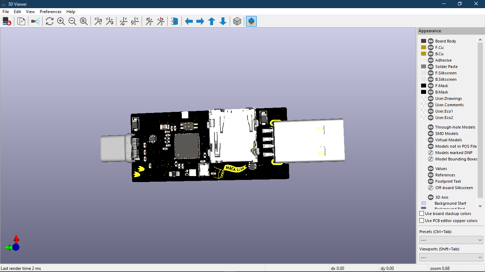
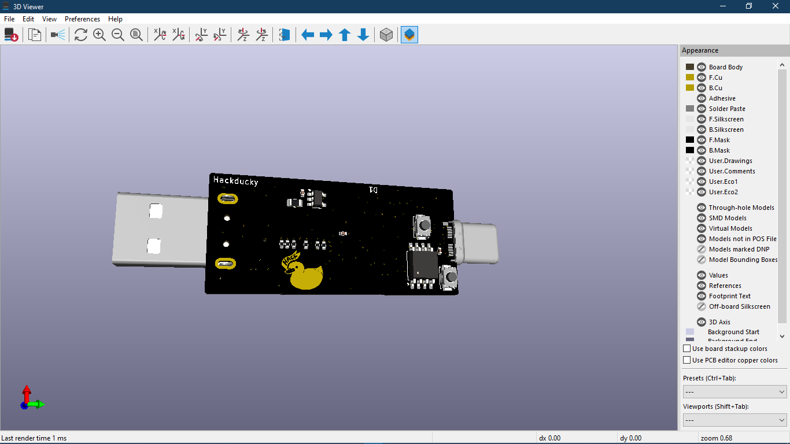

# 🦆 HackDucky

HackDucky is a compact, powerful RP2040-based USB device inspired by the concept of a "USB Rubber Ducky" — but fully open-source and customizable. It features dual USB ports (Type-A & Type-C), RGB status indicator, SD card support, and a generous 16MB flash. Ideal for scripting, automation, HID emulation, and more!

## 🔧 Features

* **RP2040 Microcontroller** – Dual-core Arm Cortex-M0+ @ 133MHz
* **16MB Flash** – Plenty of room for Ducky scripts, firmware, and more
* **USB-C & USB-A Ports** – Plug into any host device with ease
* **Micro SD Card Slot** – Store payloads, logs, or configs externally
* **RGB Neopixel** – Visual feedback for status, payload execution, etc
* **Compact Custom PCB** – Designed with portability and DIY hacking in mind

## 🧠 What Can It Do?

* Act as a USB HID device (keyboard/mouse automation)
* Emulate serial or mass storage devices
* Read payloads from SD card and execute them
* Light up RGB based on execution state (idle, running, error)
* Load firmware like CircuitPython, TinyUSB, or custom UF2 payloads

## 💻 Getting Started

1. **Flash Firmware**
   Connect via USB and flash with your favorite firmware (e.g. CircuitPython, Raspberry Pi Pico SDK UF2, etc).

2. **Insert SD Card (Optional)**
   Load your payloads/scripts/configs on a FAT32-formatted card.

3. **Connect to Host via USB-A**
   HackDucky will start executing its payload or HID script automatically (depending on firmware).

4. **RGB Status LED**
  

## ⚡ Power & USB Notes

* Use **USB-C & USB-A for power and flashing**

## 🧰 Tools Used

* KiCad for PCB Design
* RP2040 SDK / CircuitPython
* Open-source hardware and firmware philosophy

## 📸 Preview
.png)
.png)

## 🔐 Disclaimer

This device is for **educational and ethical hacking purposes only**. Use responsibly. The creators is not responsible for any misuse.

---

## 📫 Connect

Built with ❤️ by [Souptik Samanta](https://souptik.me) & [Arav Jhamb](https://github.com/The-UnknownHacker)

GitHub: [@souptik-samanta](https://github.com/souptik-samanta) & [Arav Jhamb](https://github.com/The-UnknownHacker)
Instagram: [@souptik.me](https://instagram.com/souptik.me) & [Arav Jhamb](https://github.com/The-UnknownHacker)
Hack Clubber & Hardware Hacker 💻🔌             Hack Clubber & Ethical Hacker 💻🔌
 

